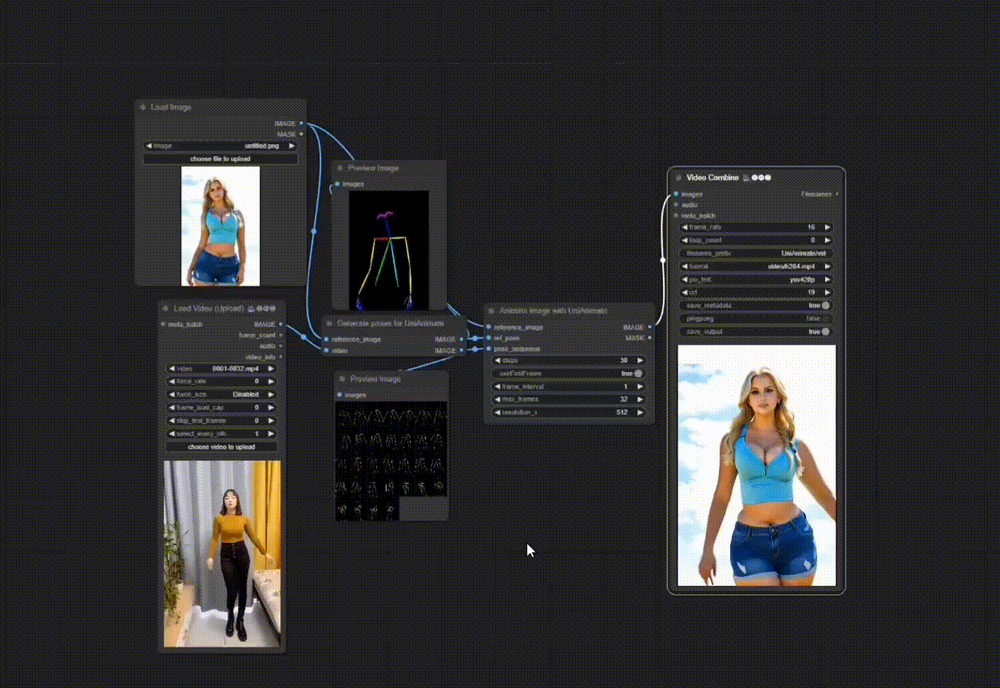

<!-- main documents -->


<div align="center">



## ComfyUi-windows implementation for the image animation project -> UniAnimate: Taming Unified Video Diffusion Models for Consistent Human Image Animation

[🎨 UniAnimate Project Page](https://unianimate.github.io/)

</div>


## Getting Started

The ComfyUI nodes created are `Align & Generate poses for UniAnimate` & `Animate image with UniAnimate`

I used a ComfyUI_windows_portable to test the nodes in a Windows 10 OS with 16GB RAM & 12GB VRAM Nvidia Graphics Card

Download or clone this repository and place it in ComfyUI_windows_portable\ComfyUI\custom_nodes\

You will need python>=3.9 in your ComfyUI Environment.
I tested the project with the following pytorch versions which you can install as follows

```
conda install pytorch==2.0.1 torchvision==0.15.2 torchaudio==2.0.2 pytorch-cuda=11.8 -c pytorch -c nvidia

``` 

Or

```
conda install pytorch==2.3.1 torchvision==0.18.1 torchaudio==2.3.1 pytorch-cuda=11.8 -c pytorch -c nvidia

```

If not installed, then:


```
pip install opencv-python
pip install pytorch_lightning
pip install lightning_utilities 
pip install lightning_fabric
pip install torchmetrics
pip install xFormers = 0.0.20 or copy torch 2.0.1 and supporting libraries and xFormer from A1111 and place in your Environment\Lib\site-packages (or) pip3 install -U xformers --index-url https://download.pytorch.org/whl/cu118 (for pytorch==2.3.1)
pip install oss2
pip install einops
pip install args
pip install modelscope

```


Download the required models (Around 14GB) after installing modelscope :

```
python modeldownloader.py

```

After downloading all the models, move them manually from 'checkpoints/iic/unianimate/' to the 'checkpoints' directory
Or move them via your command line interface:

```
python mv ./checkpoints/iic/unianimate/* ./checkpoints/

```

All the models should be in the  '\Path-to-UniAnimate\checkpoints' folder as follows:


```
./checkpoints/
|---- dw-ll_ucoco_384.onnx
|---- open_clip_pytorch_model.bin
|---- unianimate_16f_32f_non_ema_223000.pth 
|---- v2-1_512-ema-pruned.ckpt
└---- yolox_l.onnx

```

You can now upload the workflow in your '\Path-to-UniAnimate\' folder which is titled 'basicUniAnimateWorkflow.json', install missing custom nodes with the ComfyUI Manager if necessary, upload a picture & video (You can use those in the 'assets' folder), and run!


**<font color=red>&#10004; Note </font>**:

- > In the 'Align & Generate poses for UniAnimate' node, the first frame in the target pose sequence is used to calculate the scale coefficient of the alignment. Therefore, if the first frame in the target pose sequence contains the entire face and pose (hand and foot), it can help obtain more accurate estimation and better video generation results.

- > To run the "Animate image with UniAnimate" node, **~12G** GPU memory will be used. If your GPU is smaller than this, you can change the  `max_frames: 32` to other values, e.g., 24, 16, and 8.

- > You can also generate a video first, and then upload the last frame of the video as a pic to generate the next frames with `useFirstFrame` set to true in the `Align & Generate poses for UniAnimate` node.

- > Generating 32 frames of video with a resolution of [512, 768] usually takes about 7 minutes.


<div align="center"> Developer: Isimemen Omoifo Jnr </div>


## Disclaimer
 
I explicitly disclaim any responsibility for user-generated content. Users are solely liable for their actions while using these nodes and the generative model. I and the source project contributors have no legal affiliation with, nor accountability for, users' behaviors. It is imperative to use these nodes and the generative model responsibly, adhering to both ethical and legal standards.
