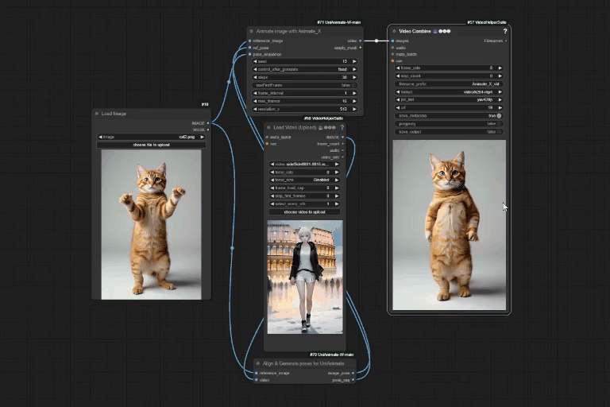

<!-- main documents -->


<div align="center">

UniAnimate


Animate-x


## ComfyUI-Windows implementation of the image animation projects: UniAnimate & Animate-X
[🎨 UniAnimate Project Page](https://unianimate.github.io/)

[🎨 Animate-x Project Page](https://lucaria-academy.github.io/Animate-X/)
</div>

## Updates

30/12/2024: Added a version 2 node for animate-x named `Animate image with Animate_X_v2`. In addition to the Explicit Pose Indicator (EPI), the Implicit Pose Indicator (IPI) mentioned in the animate-x paper was implemented in this node and it provides a slight improvement over the previous animate-x nodes in resulting videos. Also added a `Repose image with Animate_X_v2` node which did not show much improvement over the `Repose image with Animate_X` node in image to image pose transfer tests. The `Repose image with UniAnimate` node is much better for image to image pose transfer.

24/12/2024: Added a new node for dwpose extraction named `Generate dwpose`. The advantage of this node over the `Align & Generate poses for UniAnimate`node is that it does not throw an error when the target image cannot be read by the DWposeDetector, allowing the generation to proceed. But note that both nodes will not work and might throw a 'cannot convert float infinity to integer' error if the driving video or image cannot be read. The downside is that the output dwpose is not aligned with the target image like the `Align & Generate poses for UniAnimate`node attempts to do. To achieve a result where body proportions are maintained, you must manually align the person in the target image with the person in the driving video or image before uploading them. Also note that the `Generate dwpose` and `Align & Generate poses for UniAnimate`nodes are only needed by the `Animate image with Animate_X` and `Animate image with UniAnimate` nodes. You can achieve similar effects of the `Generate dwpose` and `Align & Generate poses for UniAnimate` nodes in the other nodes by setting the dontAlignPose parameter to True and False respectively.

20/12/2024: Added seperate config and UNET files for Animate-X to solve error identified in [issue #22](https://github.com/Isi-dev/ComfyUI-UniAnimate-W/issues/22)

17/12/2024: Released a [video](https://youtu.be/OKFf8J-eMIc) comparing Animate_X with UniAnimate 

16/12/2024: Added three nodes and associated workflows for Animate-X: `Repose image with Animate_X` for img2img pose transfer, `Animate image with Animate_X` for img2vid generation, and `Animate image with Animate_X_Long` for long video generation. 
Install or Update this repository with the ComfyUI Manager to get these nodes. You will need to download the `animate-x_ckpt.pth` model and place it in 'ComfyUI-UniAnimate-W/checkpoints/' folder to use these nodes. The other four checkpoints required are the same as those used by UniAnimate. 
You can download the checkpoints here:https://huggingface.co/Shuaishuai0219/Animate-X/tree/main
The code for Animate-X is almost the same as that for UniAnimate, so I decided to include the Animate-X nodes here rather than creating a new repository. The requirements are also the same.
You can visit the Animate-X repo via this link: https://github.com/antgroup/animate-x


09/09/2024: Released a [video](https://youtu.be/Ne-DSBhfg8A) on using the two new UniAnimate nodes for best results 

07/09/2024: Added two nodes: `Animate image with UniAnimate_Long` for long video generation, and `Repose image with UniAnimate` for img2img pose transfer


## Getting Started

The ComfyUI nodes created are `Align & Generate poses for UniAnimate` & `Animate image with UniAnimate`    

I used a ComfyUI_windows_portable to test the nodes in a Windows 10 OS with 16GB RAM & 12GB VRAM Nvidia Graphics Card

Download or clone this repository and place it in ComfyUI_windows_portable\ComfyUI\custom_nodes\. Or install via the ComfyUI Manager by searching for

```
UniAnimate Nodes for ComfyUI
```

You will need python>=3.9 in your ComfyUI Environment.
I tested the project with the following pytorch versions which you can install as follows

```
conda install pytorch==2.0.1 torchvision==0.15.2 torchaudio==2.0.2 pytorch-cuda=11.8 -c pytorch -c nvidia

``` 

Or

```
conda install pytorch==2.3.1 torchvision==0.18.1 torchaudio==2.3.1 pytorch-cuda=11.8 -c pytorch -c nvidia

```

If not installed, then:


```
pip install opencv-python
pip install pytorch_lightning
pip install lightning_utilities 
pip install lightning_fabric
pip install torchmetrics
pip install xFormers = 0.0.20 or copy torch 2.0.1 and supporting libraries and xFormer from A1111 and place in your Environment\Lib\site-packages (or) pip3 install -U xformers --index-url https://download.pytorch.org/whl/cu118 (for pytorch==2.3.1)
pip install oss2
pip install einops
pip install args
pip install onnxruntime-gpu==1.13.1
pip install modelscope

```


Download the required models (Around 14GB) after installing modelscope :

```
python modeldownloader.py

```

After downloading all the models, move them manually from 'checkpoints/iic/unianimate/' to the 'checkpoints' directory
Or move them via your command line interface:

```
python mv ./checkpoints/iic/unianimate/* ./checkpoints/

```
You can manually download the unianimate checkpoint from here: https://huggingface.co/camenduru/unianimate/tree/main

All the models should be in the  '\Path-to-UniAnimate-W\checkpoints' folder as follows:


```
./checkpoints/
|---- animate-x_ckpt.pth
|---- dw-ll_ucoco_384.onnx
|---- open_clip_pytorch_model.bin
|---- unianimate_16f_32f_non_ema_223000.pth 
|---- v2-1_512-ema-pruned.ckpt
└---- yolox_l.onnx

```

You can now upload the workflow in your '\Path-to-UniAnimate-W\' folder which is titled 'UniAnimateImg2Vid.json', install missing custom nodes with the ComfyUI Manager if necessary, upload a picture & video (You can use those in the 'assets' folder), and run!


**<font color=red> Note </font>**:

- > In the 'Align & Generate poses for UniAnimate' node, The first frame of the target pose sequence is used to calculate the scale coefficient for aligning the pose sequence with the reference image. If this frame includes the entire face and full-body pose (hands and feet), it will result in more accurate estimations and better video generation results.

- > To run the `Animate image with UniAnimate` node, **~12GB** of GPU memory will be used. If your GPU has less memory, you can reduce the max_frames value from 32 to 24, 16, or 8.

- > You can also generate a video first, and then upload the last frame of the video as a pic to generate the next frames with `useFirstFrame` set to true in the `Align & Generate poses for UniAnimate` node.

- > Generating 32 frames of video with a resolution of [512, 768] usually takes about 7 minutes for unianimate & 8 minutes for animate-x.

You can also change the pose of an image to that of another image as shown below.

<div align="center">


You can watch a video on the basic workflow [here](https://youtu.be/vR8EHoAQziI) 
<br></br>
You can watch a video on the Installation [here](https://youtu.be/NFnhELV4bG0)

</div>

## Support
If you find this project helpful, you can support me here:  
[](https://buymeacoffee.com/isiomo)

## Disclaimer
 
I am not responsible for any user-generated content. Users are fully responsible for their actions when using these nodes and the generative models. Neither I nor the contributors to the UniAnimate and Animate-x projects have any legal affiliation with or accountability for users' behaviors. It is crucial to use these nodes and the generative models responsibly, following both ethical and legal standards.
